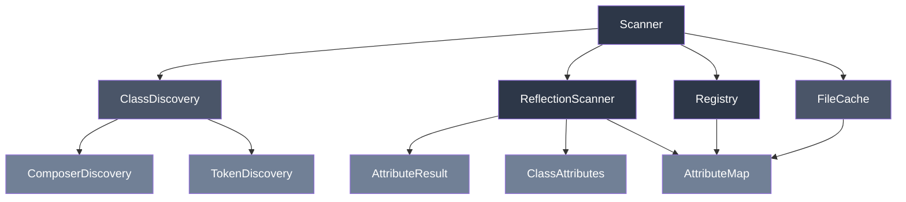

# phpdot/attribute

PHP 8 attribute scanning, caching, and discovery. Standalone. Zero runtime dependencies.

## Install

```bash
composer require phpdot/attribute
```

## Architecture



## Usage

### Scan specific classes

```php
use PHPdot\Attribute\Scanner;

$scanner = new Scanner();
$scanner->scanClasses([
    App\Controller\UserController::class,
    App\Controller\PostController::class,
]);

$registry = $scanner->registry();
```

### Scan directories

```php
$scanner = new Scanner();
$scanner->scan([__DIR__ . '/src/Controller']);

$registry = $scanner->registry();
```

### With caching

```php
use PHPdot\Attribute\Cache\FileCache;

$cache = new FileCache(__DIR__ . '/var/cache/attributes.php');
$scanner = new Scanner(cache: $cache);

$scanner->scanClasses([...]);
// Second call reads from cache
$scanner->scanClasses([...]);

// Force rescan
$scanner->scanClasses([...], forceRescan: true);

// Clear cache
$scanner->clearCache();
```

### Query the registry

```php
$registry = $scanner->registry();

// Find all results for an attribute
$routes = $registry->findByAttribute(Route::class);

// Find class-level attributes only
$classRoutes = $registry->findClassAttributes(Route::class);

// Find method-level attributes only
$methodRoutes = $registry->findMethodAttributes(Route::class);

// Find property-level attributes
$columns = $registry->findPropertyAttributes(Column::class);

// Find parameter-level attributes
$validated = $registry->findParameterAttributes(Validated::class);

// Get attributes for a specific class
$classAttrs = $registry->findByClass(UserController::class);

// Get attributes for a specific method
$methodAttrs = $registry->findByMethod(UserController::class, 'store');

// Check if an attribute exists anywhere
$hasRoutes = $registry->hasAttribute(Route::class);

// Get all class names with an attribute
$classes = $registry->getClassesWithAttribute(Route::class);

// Find by structure type
$enums = $registry->findEnums();
$interfaces = $registry->findInterfaces();

// Find by inheritance
$children = $registry->findExtending(BaseController::class);
$implementors = $registry->findImplementing(Cacheable::class);

// Count
$count = $registry->count();
$routeCount = $registry->countByAttribute(Route::class);
```

### ClassAttributes queries

```php
$classAttrs = $registry->findByClass(UserController::class);

$classAttrs->classAttributes();           // class-level only
$classAttrs->methodAttributes();          // all method-level
$classAttrs->methodAttributes('store');   // specific method
$classAttrs->propertyAttributes();        // all property-level
$classAttrs->propertyAttributes('name');  // specific property
$classAttrs->parameterAttributes('store'); // params of specific method
$classAttrs->constantAttributes();        // constant-level
$classAttrs->has(Route::class);           // check attribute exists
$classAttrs->get(Route::class);           // first match
$classAttrs->all();                       // everything
```

### Discovery strategies

**ComposerDiscovery** — reads `vendor/composer/autoload_classmap.php`. Fastest. Requires `composer dump-autoload -o`.

**TokenDiscovery** — scans PHP files with `PhpToken::tokenize()`. No prerequisites. Fallback when classmap is unavailable.

**ClassDiscovery** — combines both. Tries Composer first, falls back to token scanning.

```php
use PHPdot\Attribute\Discovery\ClassDiscovery;
use PHPdot\Attribute\Discovery\ComposerDiscovery;
use PHPdot\Attribute\Discovery\TokenDiscovery;

$discovery = new ClassDiscovery(
    composerDiscovery: new ComposerDiscovery(),
    tokenDiscovery: new TokenDiscovery(),
);

$classes = $discovery->discover(
    directories: [__DIR__ . '/src'],
    projectRoot: __DIR__,
    namespaces: ['App\\'],
    excludePatterns: ['*Test*'],
);
```

## Enums

### TargetType

```php
TargetType::CLASS_TYPE   // class-level attribute
TargetType::METHOD       // method-level attribute
TargetType::PROPERTY     // property-level attribute
TargetType::PARAMETER    // parameter-level attribute
TargetType::CONSTANT     // constant-level attribute
```

### StructureType

```php
StructureType::CLASS_TYPE      // class
StructureType::INTERFACE_TYPE  // interface
StructureType::TRAIT_TYPE      // trait
StructureType::ENUM_TYPE       // enum
```

## Requirements

- PHP >= 8.3
- Zero runtime dependencies

## License

MIT
